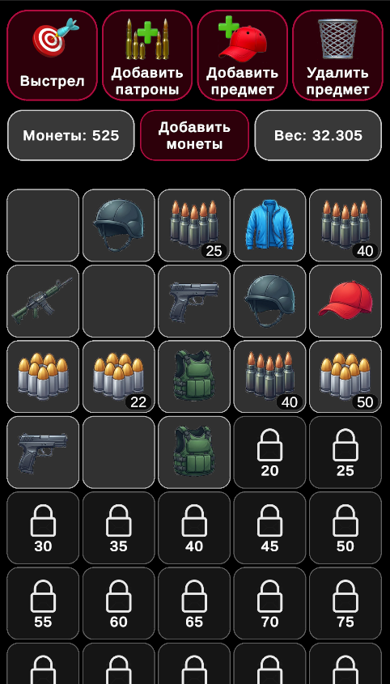
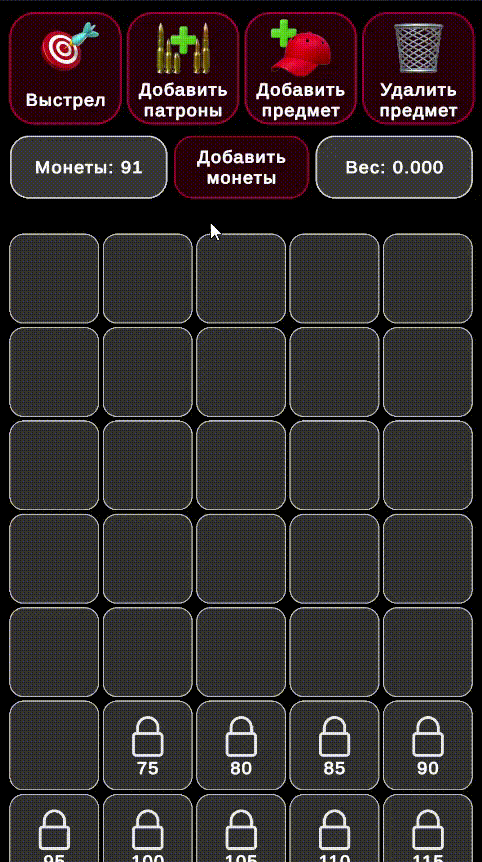

# Inventory

Тестовый проект: инвентарь на 50 слотов, монеты, разблокировка слотов, геймплей-кнопки и сохранение состояния в JSON.

<p align="center">
  
</p>

---

## Демонстрация

### Геймплей

<p align="center">
  
</p>

---

## Возможности

| Модуль | Описание |
|--------|----------|
| **Монеты** | Начисление и списание, списание при нехватке средств невозможно |
| **Инвентарь** | 50 слотов, сетка 5×N, прокрутка; по умолчанию открыто 15 слотов |
| **Разблокировка** | По порядку, за монеты; стоимость каждого слота настраивается |
| **Вес** | Суммарный вес предметов в интерфейсе |
| **Сохранение** | JSON в `persistentDataPath` (без PlayerPrefs) |
| **Опционально** | Drag-and-drop, стаки, обмен, всплывающая информация о предмете |

---

## Геймплей (кнопки)

| Кнопка | Действие |
|--------|----------|
| Добавить монеты | Случайное количество монет (диапазон в `GameplayConfig`) |
| Добавить предмет | Случайный предмет (оружие / голова / торс) |
| Добавить патроны | Случайный тип и количество патронов со стаками |
| Выстрел | Расход патронов из выбранного оружия |
| Удалить предмет | Очистка случайного непустого разблокированного слота |

Сообщения о действиях выводятся в **Console**; баланс монет и вес — в **UI**.

---

## Технологии

- **Unity** `2022.3.62f2`
- **Целевая платформа:** Android (портретная ориентация)
- **DI:** Zenject
- **Данные:** ScriptableObjects (`ItemDatabase`, `InventoryConfig`, `GameplayConfig`)
- **Логика:** POCO-классы, фасад инвентаря, минимум логики в `MonoBehaviour`

---

## Требования

- Unity **2022.3.62** (LTS)
- Модуль **Android Build Support** (для сборки под Android)
- Клонирование репозитория и открытие папки проекта через **Unity Hub**

---

## Структура (кратко)

```
Assets/_Project/
├── Scenes/          # игровые сцены
├── Scripts/         # логика, UI, инсталлеры
├── Configs/         # ScriptableObject-скрипты
└── ...
Assets/Resources/Configs/   # конфиги (ItemDatabase, InventoryConfig, …)
```

Подробная архитектура описана в коде: фасад инвентаря, операции со слотами, кошелёк, сохранение `GameStateJsonFile`.

---